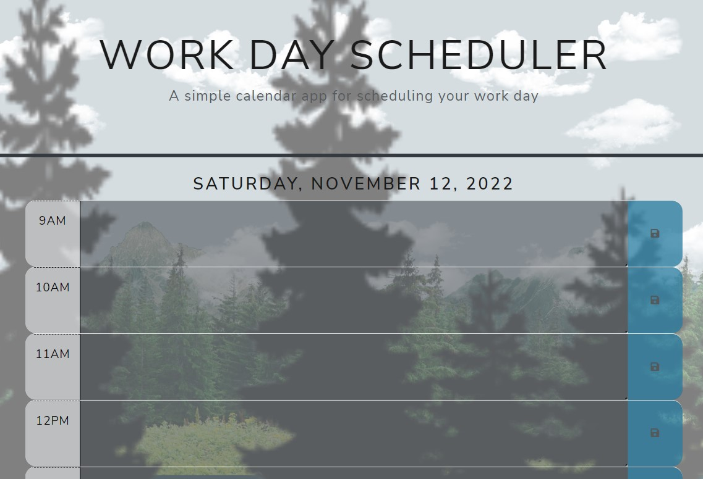

# Work-Day-Scheduler

## Description
The Work Day Scheduler application allows users to save events for each hour of the day. This application runs in the browser and features color-coded entry options that easily allows you to know the present, past and future times of your appointments/tasks. There is also a wonderful feature to allow for your schedule to be cleared from the interface and local storage. This application adapts to multiple screen sizes.

## Purpose
The Work Day Scheduler application has a clear and easy-to-use interface that allows users to plan their work day with ease and organization.

## Installation
To install my project use the following link: https://github.com/dianavw8/Work-Day-Scheduler and follow these simple directions:

Above the list of files, click on the "Code" button.

Copy the URL for the repository.

Open Git Bash.

Change the current working directory to the location where you want the cloned directory.

Type git clone, and then paste the URL you copied earlier.

Press Enter to create your local clone.

For more help and information achiving this, check out the following website: https://docs.github.com/en/repositories/creating-and-managing-repositories/cloning-a-repository

## Usage
The refactored website can be found at: https://dianavw8.github.io/Work-Day-Scheduler/

The following image demonstrates the web application's appearance and functionality:

## Lessons Learned
The Work Day Scheduler project used a lot of conditionals (if's and else's) that needed to be precise to allow for the proper function of the scheduler. Working with the Day.js library helped to set the proper times and dates for the application. Over all this was a fun project and loved the result of the application that I plan to use the Work Day Scheduler for myself.

## Credits and Inspiration
https://github.com/dianavw8

https://coding-boot-camp.github.io/full-stack/github/professional-readme-guide

https://docs.github.com/en/repositories/creating-and-managing-repositories/cloning-a-repository

https://blog.stackfindover.com/css-background-animation-examples/

